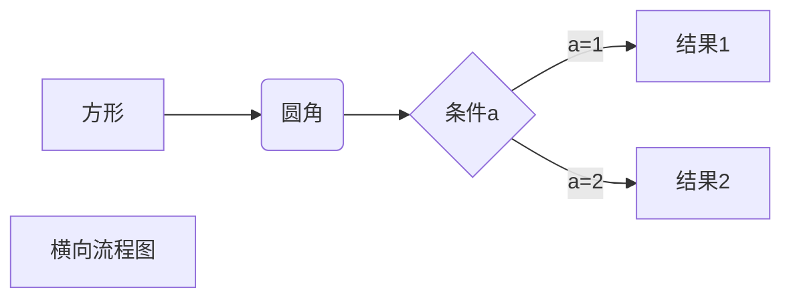
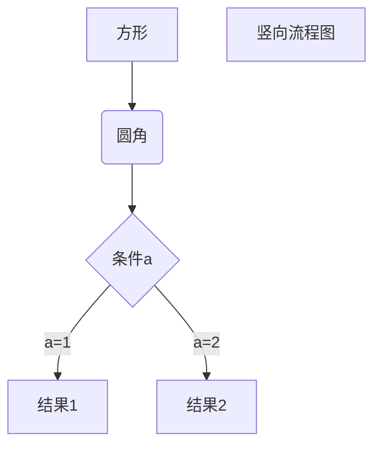
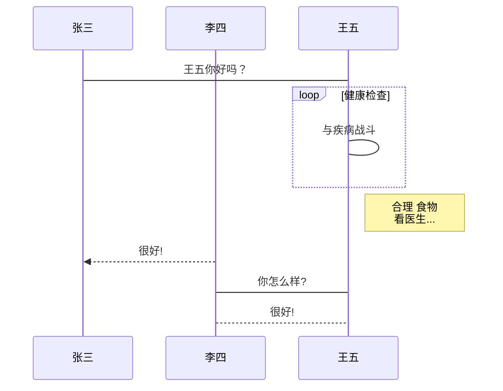
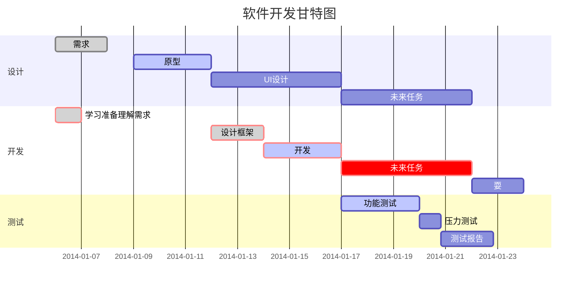

## 一、标题

Markdown 标题有两种格式

### 1、使用 = 和 - 标记一级和二级标题
= 和 - 标记语法格式如下：
代码：
```
我展示的是一级标题
=================

我展示的是二级标题
-----------------
```

效果：

我展示的是一级标题
=================

我展示的是二级标题
-----------------


### 2、在想要设置为标题的文字前面加#来表示

一个#是一级标题，二个#是二级标题，以此类推。支持六级标题。

注：标准语法一般在#后跟个空格再写文字，貌似简书不加空格也行。

示例：
```
# 这是一级标题

## 这是二级标题

### 这是三级标题

#### 这是四级标题

##### 这是五级标题

###### 这是六级标题
```

# 这是一级标题

## 这是二级标题

### 这是三级标题

#### 这是四级标题

##### 这是五级标题

###### 这是六级标题


## 二、字体

代码：
```
**这是加粗的文字**

*这是倾斜的文字*`

***这是斜体加粗的文字***

~~这是加删除线的文字~~
```
效果： 

**这是加粗的文字**

*这是倾斜的文字*`

***这是斜体加粗的文字***

~~这是加删除线的文字~~


## 三、引用

在引用的文字前加>即可。引用也可以嵌套，如加两个>>三个>>>n个...

貌似可以一直加下去，但没神马卵用

代码：
```
>这是引用的内容
>>这是引用的内容
>>>这是引用的内容
```

效果：

>这是引用的内容
>>这是引用的内容
>>>这是引用的内容


## 四、分割线

三个或者三个以上的 - 或者 * 都可以。

代码：
```
---
----
***
*****
```

效果：

---
----
***
*****


## 五、图片

Markdown 图片语法格式如下：
```


```

图片alt就是显示在图片下面的文字，相当于对图片内容的解释。图片title是图片的标题，当鼠标移到图片上时显示的内容。title可加可不加
代码：
```

```
效果：


## 六、超链接

语法：

`[超链接名](超链接地址"超链接title")title可加可不加`

示例代码1（行内超链接）：

```
[简书](http://jianshu.com)

[百度](http://baidu.com)
```
效果：

[简书](http://jianshu.com)

[百度](http://baidu.com)


示例代码2（参考超链接）：

```
I get 10 times more traffic from [Google][1] than from [Yahoo][2] or [MSN][3].

[1]: http://google.com/  "Google"
[2]: http://search.yahoo.com/ "Yahoo Search"
[3]: http://search.msn.com/  "MSN Search"
```
效果：

I get 10 times more traffic from [Google][1] than from [Yahoo][2] or [MSN][3].

[1]: http://google.com/  "Google"
[2]: http://search.yahoo.com/ "Yahoo Search"
[3]: http://search.msn.com/  "MSN Search"

示例代码3(脚注)：
```
这是一个链接到谷歌的[^脚注1]。

[^脚注1]: http://www.google.com
```
效果：

这是一个链接到谷歌的[^脚注1]。

[^脚注1]: http://www.google.com

示例代码4 ：

直接使用链接地址：
```
<https://www.runoob.com>
```
效果：

<https://www.runoob.com>


## 七、列表

### 无序列表

语法：无序列表用 - + * 任何一种都可以

代码：
```
- 列表内容1
   - A
   - B
+ 列表内容2
   - A
   - B
```
效果：
- 列表内容
   - A
   - B
+ 列表内容
   - A
   - B


### 有序列表

语法：数字加点

代码：
```
1.列表内容
   - 1.1
   - 1.2

2.列表内容
   - 2.1
   - 2.2
```
效果：

1.列表内容
   - 1.1
   - 1.2

2.列表内容
   - 2.1
   - 2.2

`注意：序号跟内容之间要有空格`


## 八、表格

语法：
```
| 左对齐 | 右对齐 | 居中对齐 |
| :--| --: | :--: |
| a | b | c |
| a | b | c |
```
效果：

| 左对齐 | 右对齐 | 居中对齐 |
| :--| --: | :--: |
| a | b | c |
| a | b | c |


## 九、代码

单行代码：代码之间分别用一个反引号包起来

代码：
```
`代码内容`
```
效果：

`代码内容`


代码块：代码之间分别用三个反引号包起来，且两边的反引号单独占一行
```
    ```
    line1
    line2
    ```
```
效果：
```
line1
line2
```

使用 4 个空格或者一个制表符（Tab 键）。

    111

## 十、流程图


```flow
s=start:开始
e=end:结束
o=operation:操作项
s-o-e
```


```flow
st=>start: 开始
op=>operation: My Operation
cond=>condition: Yes or No?
e=>end
st->op->cond
cond(yes)->e
cond(no)->op
&
```


### 区块中使用列表

> 1. 第一项
> 2. 第二项
>    - 2.1 第二项
> + 第一项
> + 第2项
>     + 第2.1项


## Markdown 高级技巧

支持的 HTML 元素
不在 Markdown 涵盖范围之内的标签，都可以直接在文档里面用 HTML 撰写。

目前支持的 HTML 元素有：`<kbd> <b> <i> <em> <sup> <sub> <br>`等 ，如：
```
使用 <kbd>Ctrl</kbd>+<kbd>Alt</kbd>+<kbd>Del</kbd> 重启电脑
```
效果：

使用 <kbd>Ctrl</kbd>+<kbd>Alt</kbd>+<kbd>Del</kbd> 重启电脑

转义字符：

代码：
```
**文本加粗** 
\*\* 正常显示星号 \*\*
```
效果：

**文本加粗** 
\*\* 正常显示星号 \*\*


## Markdown 支持以下这些符号前面加上反斜杠来帮助插入普通的符号：
```
\   反斜线
`   反引号
*   星号
_   下划线
{}  花括号
[]  方括号
()  小括号
#   井字号
+   加号
-   减号
.   英文句点
!   感叹号
```

## 公式

您可以使用渲染LaTeX数学表达式 [KaTeX](https://khan.github.io/KaTeX/):

Gamma公式展示 $\Gamma(n) = (n-1)!\quad\forall
n\in\mathbb N$ 是通过欧拉积分

$$
\Gamma(z) = \int_0^\infty t^{z-1}e^{-t}dt\,.
$$


当你需要在编辑器中插入数学公式时，可以使用两个美元符 $$ 包裹 TeX 或 LaTeX 格式的数学公式来实现。提交后，问答和文章页会根据需要加载 Mathjax 对数学公式进行渲染。如：


$\Gamma(n) = (n-1)!\quad\forall
n\in\mathbb N$ 

$$
\mathbf{V}_1 \times \mathbf{V}_2 =  \begin{vmatrix} 
\mathbf{i} & \mathbf{j} & \mathbf{k} \\
\frac{\partial X}{\partial u} &  \frac{\partial Y}{\partial u} & 0 \\
\frac{\partial X}{\partial v} &  \frac{\partial Y}{\partial v} & 0 \\
\end{vmatrix}
$$tep1}{\style{visibility:hidden}{(x+1)(x+1)}}
$


流程图实例：
以下几个实例效果图如下：

1、横向流程图源码格式：



2、竖向流程图源码格式：


3、标准流程图源码格式：

```flow
st=>start: 开始框
op=>operation: 处理框
cond=>condition: 判断框(是或否?)
sub1=>subroutine: 子流程
io=>inputoutput: 输入输出框
e=>end: 结束框
st->op->cond
cond(yes)->io->e
cond(no)->sub1(right)->op
```
4、标准流程图源码格式（横向）：

```flow
st=>start: 开始框
op=>operation: 处理框
cond=>condition: 判断框(是或否?)
sub1=>subroutine: 子流程
io=>inputoutput: 输入输出框
e=>end: 结束框
st(right)->op(right)->cond
cond(yes)->io(bottom)->e
cond(no)->sub1(right)->op
```
5、UML时序图源码样例：

```sequence
对象A->对象B: 对象B你好吗?（请求）
Note right of 对象B: 对象B的描述
Note left of 对象A: 对象A的描述(提示)
对象B-->对象A: 我很好(响应)
对象A->对象B: 你真的好吗？
```
6、UML时序图源码复杂样例：

```sequence
Title: 标题：复杂使用
对象A->对象B: 对象B你好吗?（请求）
Note right of 对象B: 对象B的描述
Note left of 对象A: 对象A的描述(提示)
对象B-->对象A: 我很好(响应)
对象B->小三: 你好吗
小三-->>对象A: 对象B找我了
对象A->对象B: 你真的好吗？
Note over 小三,对象B: 我们是朋友
participant C
Note right of C: 没人陪我玩
```
7、UML标准时序图样例：


8、甘特图样例：


